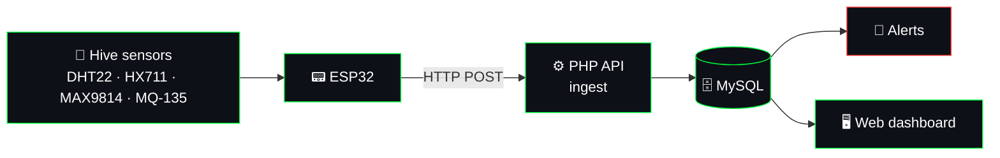

<!-- ═══════════════════════════════════════════════════════════════════
     PROFILE README · jeronimoparra-ai
     Palette  : matrix green #00FF41 · alert red #FF3131 · bg #0d1117
     Robustness: every widget has alt text; fragile services removed.
     Requires : .github/workflows/snake.yml  (creates the "output" branch)
     ═══════════════════════════════════════════════════════════════════ -->

  

 

  

 

<h2 align="center"><samp style="color:#00FF41;background:#0d1117;border:2px solid #00FF41;border-radius:6px;padding:8px 28px;font-size:26px;letter-spacing:3px;font-weight:700;">▶ ABOUT ME ◀</samp></h2>

<table>
  <tr>
    <td align="right">&nbsp;NAME&nbsp;</td>
    <td><samp><b>Andrés Jeronimo Parra Bastidas</b></samp></td>
  </tr>
  <tr>
    <td align="right">&nbsp;LOCATION&nbsp;</td>
    <td><samp>El Bagre, Antioquia 🇨🇴</samp></td>
  </tr>
  <tr>
    <td align="right">&nbsp;DEGREE&nbsp;</td>
    <td><samp>Technology in Software Development · 3rd semester</samp></td>
  </tr>
  <tr>
    <td align="right">&nbsp;STUDYING AT&nbsp;</td>
    <td><samp>IU Digital de Antioquia &nbsp;·&nbsp; SENA</samp></td>
  </tr>
  <tr>
    <td align="right">&nbsp;FOCUS&nbsp;</td>
    <td><samp>Web development · IoT · Automation · AI tooling</samp></td>
  </tr>
  <tr>
    <td align="right">&nbsp;MAIN PROJECT&nbsp;</td>
    <td><samp>🐝 <a href="https://jeronimoparra-ai.github.io/BeeStation/">BeeStation</a></samp></td>
  </tr>
  <tr>
    <td align="right">&nbsp;PHILOSOPHY&nbsp;</td>
    <td><samp><i>Learn · Build · Iterate · Grow</i></samp></td>
  </tr>
</table>

 

<h2 align="center"><samp style="color:#00FF41;background:#0d1117;border:2px solid #00FF41;border-radius:6px;padding:8px 28px;font-size:26px;letter-spacing:3px;font-weight:700;">▶ TECH STACK ◀</samp></h2>

**`// Languages`**  

 

**`// Backend & Data`**  

 

**`// Hardware & IoT`**    

 

**`// Automation & AI`**        

 

**`// Tools`**  

 

<h2 align="center"><samp style="color:#00FF41;background:#0d1117;border:2px solid #00FF41;border-radius:6px;padding:8px 28px;font-size:26px;letter-spacing:3px;font-weight:700;">▶ BEESTATION ◀</samp></h2>

  

 

> Intelligent monitoring of bioclimatic variables in *Apis mellifera* hives using IoT sensors, developed in collaboration with **SENA Centro de Formación Minero Ambiental**.

|     | Feature                                 | Description                                                |
| :-: | --------------------------------------- | ---------------------------------------------------------- |
| 🌡️ | **<samp>Temperature & Humidity</samp>** | <samp>Real-time monitoring inside the hive</samp>          |
|  📡 | **<samp>Data Transmission</samp>**      | <samp>Live data stream from IoT sensors</samp>             |
|  📊 | **<samp>Data Analysis</samp>**          | <samp>Tracking of optimal conditions for the colony</samp> |
|  🔔 | **<samp>Alert System</samp>**           | <samp>Notifications when conditions turn critical</samp>   |

&nbsp;

 

<h2 align="center"><samp style="color:#00FF41;background:#0d1117;border:2px solid #00FF41;border-radius:6px;padding:8px 28px;font-size:26px;letter-spacing:3px;font-weight:700;">▶ PROJECTS ◀</samp></h2>

> `// every project has its own identity — click a banner to open the repository`

 

### 🎙️  <samp>jarvis — voice assistant for Linux</samp>

 

  

|                  🎯 Rules first                  |          🧩 Modular skills          |           🛡️ Safe by design          |  💻 Works without a mic  |
| :----------------------------------------------: | :---------------------------------: | :-----------------------------------: | :----------------------: |
| Deterministic router; the LLM is only a fallback | Each skill is one file in `skills/` | Command whitelist + spoken `confirma` | Keyboard simulation mode |

 

### 📱  <samp>productivity-app — your academic productivity assistant</samp>

 

  

|                  ✅ Tasks                  |        📅 Calendar       |       🧠 Spaced repetition      |              ✨ AI              |
| :---------------------------------------: | :----------------------: | :-----------------------------: | :----------------------------: |
| Priorities, dates, reminders and subtasks | Monthly and weekly views | SM-2 algorithm to study smarter | Summaries and review questions |

 

 

### 📝  <samp>processadmin — academic writing and APA 7 in the browser</samp>

 

  

|      ✍️ Assisted writer      |     📚 APA 7 manager     |     📊 Rubric evaluator    |         📄 Word export         |
| :--------------------------: | :----------------------: | :------------------------: | :----------------------------: |
| Plan and draft academic work | References and citations | Chart of your rubric score | Real `.docx` with APA 7 format |

 

 

<h2 align="center"><samp style="color:#00FF41;background:#0d1117;border:2px solid #00FF41;border-radius:6px;padding:8px 28px;font-size:26px;letter-spacing:3px;font-weight:700;">▶ GITHUB STATS ◀</samp></h2>

  

### 🐍 <samp>contribution_snake</samp>

<!-- Generated by .github/workflows/snake.yml into the "output" branch -->

<picture>
  <source media="(prefers-color-scheme: dark)" srcset="https://raw.githubusercontent.com/jeronimoparra-ai/jeronimoparra-ai/output/github-snake-dark.svg"/>
  <source media="(prefers-color-scheme: light)" srcset="https://raw.githubusercontent.com/jeronimoparra-ai/jeronimoparra-ai/output/github-snake.svg"/>
  
</picture>

 

<h2 align="center"><samp style="color:#00FF41;background:#0d1117;border:2px solid #00FF41;border-radius:6px;padding:8px 28px;font-size:26px;letter-spacing:3px;font-weight:700;">▶ CURRENTLY ◀</samp></h2>

 

|                 🔭 Working on                |                     🌱 Learning                     |                       🎯 Goal                       |
| :------------------------------------------: | :-------------------------------------------------: | :-------------------------------------------------: |
| <samp>BeeStation (IoT for beekeeping)</samp> | <samp>JavaScript · Git · automation with n8n</samp> | <samp>Build a freelance career in automation</samp> |

<b><samp>🗺️ &nbsp;roadmap_2026 (click to expand)</samp></b>

 

* [x] Start the BeeStation IoT project with SENA
* [x] Build my first automations with n8n
* [x] Publish a profile that shows my work
* [ ] Ship BeeStation with live sensor data
* [ ] Land my first freelance automation client
* [ ] Keep a contribution streak going 🐍

 

<h2 align="center"><samp style="color:#00FF41;background:#0d1117;border:2px solid #00FF41;border-radius:6px;padding:8px 28px;font-size:26px;letter-spacing:3px;font-weight:700;">▶ CONNECT WITH ME ◀</samp></h2>

 

  

 

<!-- Keyboard shortcuts GIF: make sure ./assets/Atajos_de_teclado.gif exists in the repo -->

  

 

  ⚡ Every commit counts &nbsp;|&nbsp; El Bagre, Antioquia &nbsp;|&nbsp; 2026

