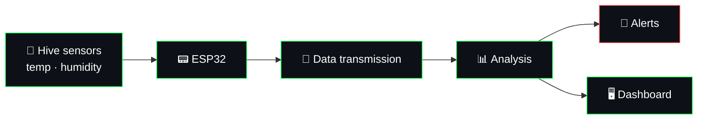

<!-- ═══════════════════════════════════════════════════════════════════
     PROFILE README · jeronimoparra-ai
     Palette  : matrix green #00FF41 · alert red #FF3131 · bg #0d1117
     Robustness: every widget has alt text; fragile services removed.
     Requires : .github/workflows/snake.yml  (creates the "output" branch)
     ═══════════════════════════════════════════════════════════════════ -->

  

 

 

## 👾 &nbsp;About Me

<table>
  <tr>
    <td align="right">&nbsp;NAME&nbsp;</td>
    <td><b>Andrés Jeronimo Parra Bastidas</b></td>
  </tr>
  <tr>
    <td align="right">&nbsp;LOCATION&nbsp;</td>
    <td>El Bagre, Antioquia 🇨🇴</td>
  </tr>
  <tr>
    <td align="right">&nbsp;DEGREE&nbsp;</td>
    <td>Technology in Software Development · 3rd semester</td>
  </tr>
  <tr>
    <td align="right">&nbsp;STUDYING AT&nbsp;</td>
    <td>IU Digital de Antioquia &nbsp;·&nbsp; SENA</td>
  </tr>
  <tr>
    <td align="right">&nbsp;FOCUS&nbsp;</td>
    <td>Web development · IoT · Automation · AI tooling</td>
  </tr>
  <tr>
    <td align="right">&nbsp;MAIN PROJECT&nbsp;</td>
    <td>🐝 <a href="https://jeronimoparra-ai.github.io/BeeStation/">BeeStation</a></td>
  </tr>
  <tr>
    <td align="right">&nbsp;PHILOSOPHY&nbsp;</td>
    <td><i>Learn · Build · Iterate · Grow</i></td>
  </tr>
</table>

 

## 🛠️ &nbsp;Tech Stack

**`// Languages`** 

 

**`// Backend & Data`** 

 

**`// Hardware & IoT`** 
&nbsp;

 

**`// Automation & AI`** 
&nbsp;
&nbsp;
&nbsp;

 

**`// Tools`** 

 

## 🐝 &nbsp;BeeStation — Main Project

> Intelligent monitoring of bioclimatic variables in *Apis mellifera* hives using IoT sensors, developed in collaboration with **SENA Centro de Formación Minero Ambiental**.

| | Feature | Description |
|:-:|---|---|
| 🌡️ | **Temperature & Humidity** | Real-time monitoring inside the hive |
| 📡 | **Data Transmission** | Live data stream from IoT sensors |
| 📊 | **Data Analysis** | Tracking of optimal conditions for the colony |
| 🔔 | **Alert System** | Notifications when conditions turn critical |

 

## 📌 &nbsp;Featured Repositories

 

## 📊 &nbsp;GitHub Stats

  

### 🐍 Contribution snake

<!-- Generated by .github/workflows/snake.yml into the "output" branch -->
<picture>
  <source media="(prefers-color-scheme: dark)" srcset="https://raw.githubusercontent.com/jeronimoparra-ai/jeronimoparra-ai/output/github-snake-dark.svg"/>
  <source media="(prefers-color-scheme: light)" srcset="https://raw.githubusercontent.com/jeronimoparra-ai/jeronimoparra-ai/output/github-snake.svg"/>
  
</picture>

 

## 🎯 &nbsp;Currently

| 🔭 Working on | 🌱 Learning | 🎯 Goal |
|:-:|:-:|:-:|
| BeeStation (IoT for beekeeping) | JavaScript · Git · automation with n8n | Build a freelance career in automation |

<b>🗺️ &nbsp;Roadmap 2026 (click to expand)</b>

 

- [x] Start the BeeStation IoT project with SENA
- [x] Build my first automations with n8n
- [x] Publish a profile that shows my work
- [ ] Ship BeeStation with live sensor data
- [ ] Land my first freelance automation client
- [ ] Keep a contribution streak going 🐍

 

## 📫 &nbsp;Connect With Me

  

<i>"Talk is cheap. Show me the code."</i> — Linus Torvalds

 

<!-- Keyboard shortcuts GIF: make sure ./assets/Atajos_de_teclado.gif exists in the repo -->

  

 

  ⚡ Every commit counts &nbsp;|&nbsp; El Bagre, Antioquia &nbsp;|&nbsp; 2026

